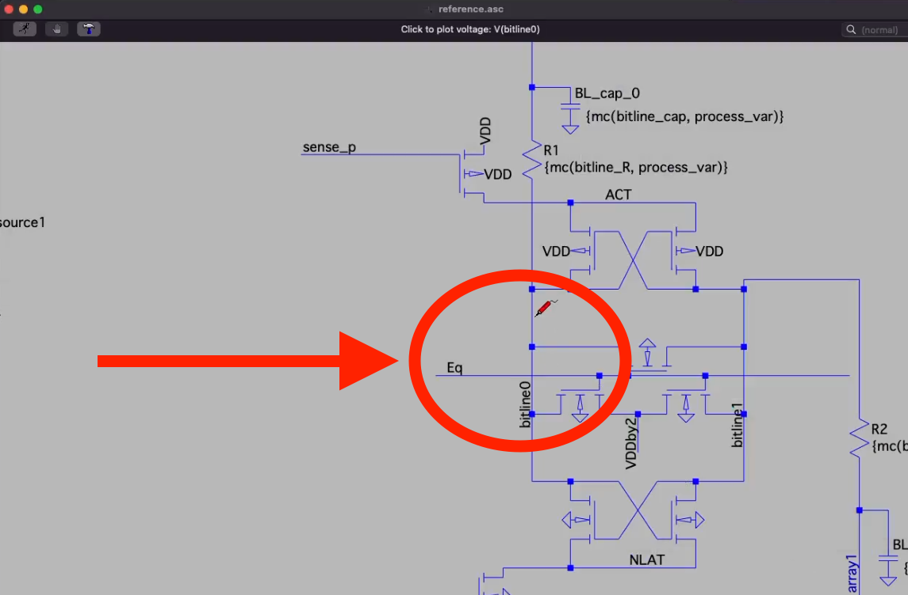

# pLUTo - SPICE Simulation

## Steps to Reproduce

1. [Download LTSpice.](https://www.analog.com/en/design-center/design-tools-and-calculators/ltspice-simulator.html)
2. Open and run the Monte Carlo simulation for each of the .asc files in LTSpice by clicking  in the LTSpice toolbar.
3. Plot the voltage value of the `bitline` wire by clicking on it in the schematic, as illustrated in the following screenshot:

## Expected Behaviour

You should observe behaviour analogous to that of the reference files provided in the folder `out`.

Example runs with exact voltage values are also included in the folder `runs`.
Note that these cannot be reproduced exactly due to the stochastic nature of the simulation.
Nevertheless, the observed behaviour should be consistent across runs.
